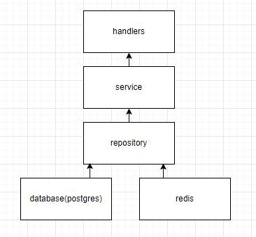

Новая иерархия слоев

такая форма получилась случайно

handlers это все обработчики запросов

statistics и db а конкретно все что было связано с users переехало в services

repository это sqlBuilder в котором собираются и выполняются запросы

db и redis соответственно самые нижнии слои работающие напрямую с бдшками

в каждом слое используется dependency injection(передаем параметрами все зависимости) для этого существует пакет interfaces

появилась папка entities туда были вынесены просто все сущности из statistics и users

дамп теперь лежит в db-dumps/Dota.sql исправленный

папка auth пока что нерабочая(то что там красное это нормас) разберусь с ней позже когда займусь аутентификацией 

сейчас абсолютно все функции работают
